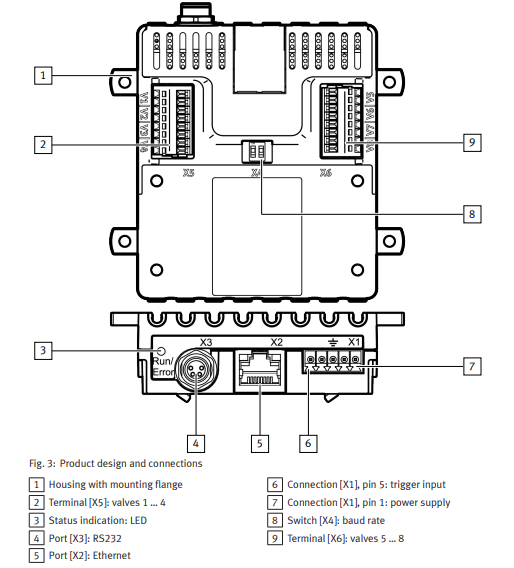

# VAEM Examples
Below will outline some examples of how to setup and run the VAEM along with basic function calls

### Ethernet 
The examples listed below will be using the Ethernet port or [5] located in the diagram below.  


### Hardware setup
In order to run the examples listed below,  

1. Ensure that the device is powered up, there should be LED indicator lights over the Ethernet port that light up when the device is powered.  
2. Connect the VAEM device to host PC via ethernet port
3. Ensure that the host PC or device's ethernet network is on the same one as the VAEM device
4. Fur further documentation on how to setup the hardware, please reference the Festo Resources section of this page

### Validating setup 
There are several different ways to validate a correct ethernet configuration and setup for the VAEM device, below are two solutions.
#### Default IP address range
A VAEM device usually has an ip address that lies within the range of 192.168.0.1->192.168.0.100. This comes preprogrammed in the firmware but can be changed if needed.  
To validate the connection:

1. Verify that the IPv4 address of the connected host PC or device's Ethernet adapter is on the same network range: 192.168.0.xxx 
2. Use the address resolution protocol (arp) to display all connections on the PC and dedicated network ranges
```cmd
arp -a
```
3. Ensure that the connection exists under the specified network ID range
4. Use ```ping``` to validate that the PC can talk to the device
```cmd
ping 192.168.0.xxx
```
#### Using the VAEM GUI and serial connection
Festo offers a VAEM user interface that can be used to change certain configurations of the device including the IP address.  
This can be used if the user already has a network of IOT devices where the VAEM needs to be integrated into or if the IP address is still not known.  

1. Download the [VAEM GUI](https://www.festo.com/assets/attachment/en/640367). 
2. Using the RS232 connection, connect host PC or device via USB to VAEM device
3. Use the GUI to connect to VAEM device.
4. Navigate to the control section of the GUI and configure the IP address
5. Disconnect from the device and cycle the power
6. Once the device has booted, connect host PC or device via Ethernet cable to VAEM device
7. Use the GUI to connect to the device with the new IP address to validate

### Coding examples
The examples below provide basic implementation of the VAEM python driver and usage.
#### Basic startup 
Before any examples that can be run, the VAEM front end and tcp configuration needs to be defined first
```py
from vaem import VAEM, VAEMTCPConfig

vaem_config = VAEMTCPConfig(interface="tcp/ip", ip="192.168.0.1", port=502)

vaem = VAEM(config=vaem_config)
```

#### Configuring and opening valves
This example script demonstrates how to use the VAEM python driver to configure and open valves based on their  
valve ID number. In order to open the valves, they must be selected and then configured. This script iterates through  
all 8 channels and configures each channel with the same opening time. 
```py
opening_time_ms = 100

for _ in range(1, 9):
    vaem.select_valve(_)
    vaem.set_valve_switching_time(valve_id=_, opening_time=opening_time_ms)

vaem.open_selected_valves()

for _ in range(1,9):
    vaem.deselect_valve(_)
```

#### Opening valves
This example script demonstrates how to open valves based on id. In order to open the valves a dictionary must be passed in  
with the valve id being the key and the actuation time being the value.
```py
valve_timings = {
    1: 100,
    2: 100,
    3: 100,
    4: 100,
    5: 100,
    6: 100,
    7: 100,
    8: 100,
}

vaem.open_valves(valve_timings)
```

#### Reading the VAEM device status and clearing errors
This example script demonstrates how to read the VAEM status word coming from the device via Python driver. The script then  
clears any errors found in the status word. For more information of the VAEM status word, please reference the Festo  
resources section of this page for the operation instruction PDF.
```py
status = vaem.get_status()
print(f"VAEM Status before clear: {status}")
vaem.clear_error()
status = vaem.get_status()
print(f"VAEM Status after clear: {status}")
```

#### Setting different channel and valve parameters based on channel ID
This example script demonstrates how to set different parameters to a specific channel on the VAEM device via Python driver.  
The script will then save these parameters to the VAEM device so they do not have to be reconfigured later.
```py
valve_id = 1

nominal_voltage_mv = 1000
vaem.set_nominal_voltage(valve_id, nominal_voltage_mv)

swithing_time_ms = 100
vaem.set_valve_switching_time(valve_id, swithing_time_ms)

delay_time_ms = 100
vaem.set_delay_time(valve_id, delay_time_ms)

pickup_time_ms = 100
vaem.set_pickup_time(valve_id, pickup_time_ms)

inrush_current_ma = 100
vaem.set_inrush_current(valve_id, inrush_current_ma)

holding_current_ma = 100
vaem.set_holding_current(valve_id, holding_current_ma)

vaem.set_error_handling(1)

vaem.save_settings()
```

#### Getting different channel and valve parameters based on channel ID
This example script demonstrates how to get different parameters from a specific channel on the VAEM device via  
Python driver.

```py
valve_id = 1

nominal_voltage_mv = vaem.get_nominal_voltage(valve_id)
print(f"Nominal Voltage (mV) for Valve {valve_id}: {nominal_voltage_mv}")

switching_time_ms = vaem.get_valve_switching_time(valve_id)
print(f"Switching Time (ms) for Valve {valve_id}: {switching_time_ms}")

delay_time_ms = vaem.get_delay_time(valve_id)
print(f"Delay Time (ms) for Valve {valve_id}: {delay_time_ms}")

pickup_time_ms = vaem.get_pickup_time(valve_id)
print(f"Pickup Time (ms) for Valve {valve_id}: {pickup_time_ms}")

inrush_current_ma = vaem.get_inrush_current(valve_id)
print(f"Inrush Current (mA) for Valve {valve_id}: {inrush_current_ma}")

holding_current_ma = vaem.get_holding_current(valve_id)
print(f"Holding Current (mA) for Valve {valve_id}: {holding_current_ma}")

error_handling_status = vaem.get_error_handling()
print(f"Current error handling status: {error_handling_status}")
```
