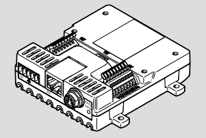

# VAEM

`festo-vaem` is a Python library enabling control and programmatic operation of Festo's VAEM 8 channel electronic valve control device.  



## Installation

### From Codebase

Navigate to the directory where the code is stored and, using pip, type in the following command:

```
pip install . -e
```

This will package the library locally and can be used as regular imports

### Official Packaged Releases

The lastest released version of this package can be found on the package registry of this project
Install using pip:

```
pip install festo-vaem --index-url <private index URL with auth>
```

### From Git Repository

If installation via PyPI does not work, the festo-vaem python driver source code can be installed directly from Github. Access the repository here: [festo-vaem Github repo](https://github.com/Festo-se/festo-vaem)

```
pip install git+https://github.com/Festo-se/festo-vaem.git
```

Or as an editable dependency with a local copy of the source code: 

1. Clone the repository

```
git clone https://github.com/Festo-se/festo-vaem.git <destination-directory>
```

2. Navigate to the clone destination directory

```
cd <destination>
```

3. Install with pip

```
pip install . -e
```

### Installation Within Virtual Environment

To install within a virtual environment, either create one by using the following command

```
python -m venv <virtual environment name> 
```

Or if one already exists, activate using:

```
<virtual environment name>\Scripts\activate.bat
```

Once activated, use the instructions from the [Release](#release) section to install the package

### Installation With uv By Astral

If your software environment utilizes uv or if you wish to begin using uv for everything python follow the instructions below.  
If uv is not already installed on the host PC or device, it can be installed following the [uv installation guide](https://docs.astral.sh/uv/getting-started/installation/), or by using pip or pipx.  
For pip:

```
pip install uv
```

For pipx:

```
pipx install uv
```

Once uv is installed or if uv is already installed on the host PC or device, use the following command to install the VAEM package into an existing virtual environment.

```
uv pip install festo-vaem
```

To add the vaem library to an existing project

```
uv add festo-vaem
```

## Pymodbus Dependency
The `festo-vaem` library uses `pymodbus` as its dependency for communicating via Ethernet and Serial connections. Although it is not necessary for the user to import or link this dependency as the library dynamically already imports this dependency, to gain a better understanding please visit [PyModbus Homepage](https://www.pymodbus.org/) or for a more in depth reading please visit [PyModbus readthedocs](https://pymodbus.readthedocs.io/en/latest/). The pypi package can also be found [here](https://pypi.org/project/pymodbus/).